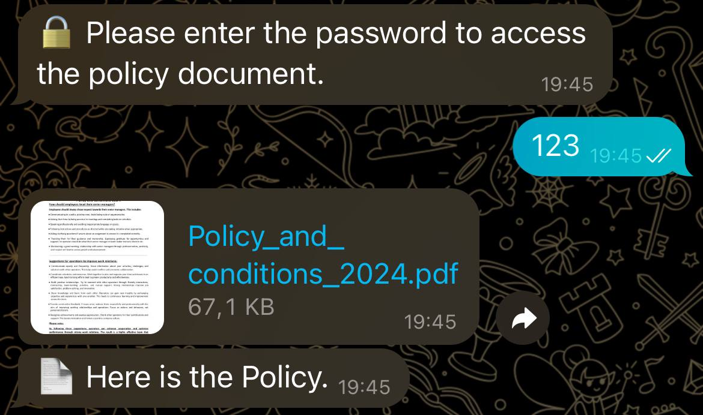
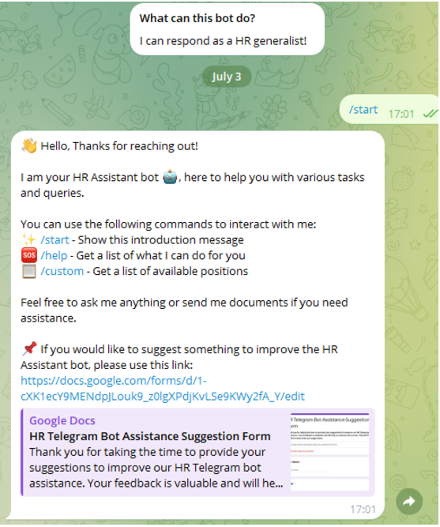
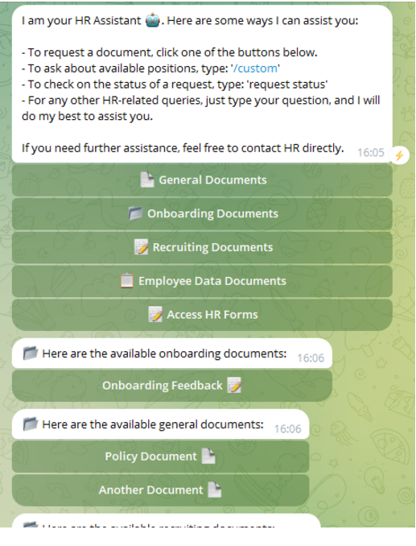

#HR Telegram Bot Report 


# Table of contents
- [Objective](#Objective)
- [Statges](#Statges)
- [Data Source](#Data-Source)
- [Stages](#Stages)
- [Design](#Design)
  - [Tools](#Tools)
- [Development](#Development)
  - [Pseudocode](#Pseudocode)
	- [Data Exploration](#Data-Exploration)
  - [Python](#Python)
    - [python Libraries]
    - [Python scripts]
    - 

# Objective
- What is the key pain point?

-Create HR TG BOT, to help employeer reach their files, data, and forms throw  

- Key Features:
  - Tools: Python, libraries, TG Botfather
  - This Bot aim to help emplooyer, teams make data-driven decisions and efficiently find their files & data.
  
### User story

  As the Head of MENA,
  I want Bot that can help me to find all departemnts (Data input, Documents, Tables, etc... ) up to date, and accessable.
  
# Data source (Google Workspace)

- Google Sheets (Tables)
- Google Forms (Data Input)
- Google Docs (Documents)
  
And any other workspace that can provide data in general.

# Stages
  
- Design
- Developement
- Testing
- publishing 

# Design

- What should the Bot respond based on the requirements provided?

To understand what it should the BOT do, we need to figure out how can assesst the user

### Tools

|Tool|Purpose|
|---|---|
|GoogleWorkspace|Exploring the data|
|Python|TO create scripts, API Integration|
|BotFather|To create API Authentication Key|
|Hoster|Website hosting services| 
|GitHub| Hosting the project documentation and version control|

# Development

### Pseudocode

- What's the general approach in creating this solution from start to finish?
1. Get Google Workspace Email access 
3. Create python script to integerate BotFather API key Authentication 
2. Explore the data in Google Workspace
4- Connecting the Bot to Google Workspace


### Bot Workflow

1. Authorize specific user access to the bot.
2. User sends a command or message to the bot.
3. Bot processes the request and retrieves the necessary information.
4. Bot responds with the appropriate document, form, or guidance.

# python 

### Libraries
```python
{
from typing import Final
from telegram import Update, InputFile, InlineKeyboardMarkup, InlineKeyboardButton
from telegram.ext import Application, CommandHandler, MessageHandler, CallbackQueryHandler, filters, ContextTypes
import os
}
```
### Bot Configuration Package

```python
{
TOKEN: Final = '6922686983:AAG8nkmCNDKkoP7i0YHFNqU9S8KCRhCfWB8'
BOT_USERNAME: Final = '@HRproBY_bot'
ALLOWED_USERNAMES: Final = ['joussef1590']  # Add the allowed usernames here
POLICY_PASSWORD: Final = '123'  # Set your desired password for the policy document

# Paths to documents and forms
DOCUMENTS: Final = {
    'policy': r'C:\Users\jouss\OneDrive\Desktop\hr_bot.py\Policy_and_ conditions_2024.pdf',
    'another_document': r'C:\Path\To\Another\Document.pdf'

# Paths to documents and forms
DOCUMENTS: Final = {
    'policy': r'C:\Users\jouss\OneDrive\Desktop\hr_bot.py\Policy_and_ conditions_2024.pdf',
    'another_document': r'C:\Path\To\Another\Document.pdf'
}

FORMS: Final = {
    'onboarding_feedback': 'https://docs.google.com/forms/d/1pIi2V-rPW5ys5yOfjTd8OVwbQBVwT8DTROJHjPK9550/edit',
    'probation_period': 'https://docs.google.com/forms/d/1j2ZBagQGEv28h7W7_UgUDAbAWwTi9hEvGi_aFNQSBmA/edit',
    'gallup_engagement': 'https://docs.google.com/forms/d/13BjskEG6sR7jvfFkbZdERkne83z_3HUQqK2vRGaTkGg/edit',
    'complaint_form': 'https://docs.google.com/forms/d/1vQzMh9tye6jiJZWdZHSj0vCuehN8j6Q14o1elwhzDNg/edit',
```

## Command Package

### Input
```python
{
# Store user states
user_states = {}

}
```

```python

{
# Commands
async def start_command(update: Update, context: ContextTypes.DEFAULT_TYPE):
    username = update.message.from_user.username
    if not is_authorized(username):
        await update.message.reply_text('❌ Unauthorized access.')
        print(f'Unauthorized user attempted to access /start: @{username}')
        return
    
    introduction = (
        "👋 Hello, Thanks for reaching out!\n\n"
        "I am your HR Assistant bot 🤖, here to help you with various tasks and queries.\n\n"
        "You can use the following commands to interact with me:\n"
        "✨ /start - Show this introduction message\n"
        "🆘 /help - Get a list of what I can do for you\n"
        "📋 /custom - Get a list of available positions\n"
        "📑 /forms - Access various HR forms\n\n"
        "Feel free to ask me anything or send me documents if you need assistance.\n\n"
        "📌 If you would like to suggest something to improve the HR Assistant bot, please use this link: "
        "https://docs.google.com/forms/d/1-cXK1ecY9MENdpJLouk9_z0lgXPdjKvLSe9KWy2fA_Y/edit"
    )
    await update.message.reply_text(introduction)
}
```

### Output 


## Authorization Check

```python
{
async def handle_message(update: Update, context: ContextTypes.DEFAULT_TYPE):
    message_type: str = update.message.chat.type
    text: str = update.message.text
    username: str = update.message.from_user.username

    print(f'user (@{username}) in {message_type}: "{text}"')

    if not is_authorized(username):
        print(f'Unauthorized user: @{username}')
        await update.message.reply_text('❌ Unauthorized access.')
        return
}

````

## Password Verification

```python
{
def handle_response(text: str, username: str) -> str:
    processed: str = text.lower()n

    if username in user_states and user_states[username] == 'awaiting_policy_password':
        if processed == POLICY_PASSWORD:
            user_states[username] = 'verified_policy_password'
            return '🔓 Password verified. Here is the policy document:'
        else:
            return '❌ Incorrect password. Please try again.'
}

```

### Output 




## Handling Document Commands and Sending Files in Async Python

```python

{
  with open(document_path, 'rb') as file:
        await context.bot.send_document(chat_id=chat_id, document=InputFile(file), filename=os.path.basename(document_path))
        await context.bot.send_message(chat_id=chat_id, text=f'📄 Here is the {doc_key.replace("_", " ").capitalize()}.')

async def document_command(update: Update, context: ContextTypes.DEFAULT_TYPE, section: str):
    documents = []
    if section == 'general_documents':
        documents = [
            ('Policy Document 📄', 'policy'),
            ('Another Document 📄', 'another_document')
        ]
    elif section == 'onboarding_documents':
        documents = [
            ('Employee Onboarding Process Feedback 📝', 'onboarding_feedback'),
            ('Probation Period Review 📝', 'probation_period')
        ]
    elif section == 'recruiting_documents':
        documents = [
            ('Recruiting Document 📄', 'another_document')  # Replace with actual recruiting documents
        ]
    elif section == 'employee_data_documents':
        documents = [
            ('L1 PS Support Team 📝', 'l1_ps_support_team'),
            ('Expansion Team MENA 📝', 'expansion_team_mena'),
            ('Expansion Team MENA (EN) 📝', 'expansion_team_mena_en'),
            ('Retention MENA (Online) 📝', 'retention_mena_online'),
            ('Retention MENA (Internal Checking) 📝', 'retention_mena_internal_checking')
        ]

    keyboard = [[InlineKeyboardButton(name, callback_data=key)] for name, key in documents]
    reply_markup = InlineKeyboardMarkup(keyboard)
    message = f"📂 Here are the available {section.replace('_', ' ')}:"
    await update.callback_query.message.reply_text(message, reply_markup=reply_markup)
}

```

### Output 




## Handling Button Clicks and Document Requests

```python

{
  form_descriptions = {
        'onboarding_feedback': "📝 Employee Onboarding Process Feedback - Share your feedback about the onboarding process.",
        'probation_period': "📝 Probation Period Review - Provide your review of the probation period.",
        'gallup_engagement': "📝 Gallup Q10 Engagement - Participate in the Gallup Q10 engagement survey.",
        'complaint_form': "📝 Employee Complaint Form - Submit a formal complaint.",
        'vacancy_description': "📝 New Vacancy Description - Describe a new job vacancy.",
        'medical_form': "📝 Medical Form - Fill out the required medical information.",
        'l1_ps_support_team': "📝 L1 PS Support Team - Enter details for the L1 PS support team.",
        'expansion_team_mena': "📝 Expansion Team MENA - Provide information for the MENA expansion team.",
        'expansion_team_mena_en': "📝 Expansion Team MENA (EN) - English version for the MENA expansion team.",
        'retention_mena_online': "📝 Retention MENA (Online) - Online details for MENA retention.",
        'retention_mena_internal_checking': "📝 Retention MENA (Internal Checking) - Internal checking for MENA retention."


    keyboard = [[InlineKeyboardButton(description, url=url)] for url, description in zip(FORMS.values(), form_descriptions.values())]
    reply_markup = InlineKeyboardMarkup(keyboard)

    forms_message = "📑 Here are the available HR forms. Click the buttons below to access them:"
    await update.callback_query.message.reply_text(forms_message, reply_markup=reply_markup)

async def button_click_handler(update: Update, context: ContextTypes.DEFAULT_TYPE):
    query = update.callback_query
    await query.answer()
    
    if query.data == 'general_documents':
        await document_command(update, context, 'general_documents')
    elif query.data == 'onboarding_documents':
        await document_command(update, context, 'onboarding_documents')
    elif query.data == 'recruiting_documents':
        await document_command(update, context, 'recruiting_documents')
    elif query.data == 'employee_data_documents':
        await document_command(update, context, 'employee_data_documents')
    elif query.data == 'forms':
        await forms_command(update, context)
    elif query.data in DOCUMENTS:
        if query.data == 'policy':
            user_states[update.callback_query.from_user.username] = 'awaiting_policy_password'
            await request_policy_password(update, context)
        else:
            await send_document(update, context, query.data)

async def request_policy_password(update: Update, context: ContextTypes.DEFAULT_TYPE):
    await update.callback_query.message.reply_text('🔒 Please enter the password to access the policy document.')
}

```
### Output 



## Setting Up and Running an Async Telegram Bot 

```python

{
def main() -> None:
    app = Application.builder().token(TOKEN).build()

    app.add_handler(CommandHandler('start', start_command))
    app.add_handler(CommandHandler('help', help_command))
    app.add_handler(CommandHandler('custom', custom_command))

    app.add_handler(CallbackQueryHandler(button_click_handler))
    app.add_handler(MessageHandler(filters.TEXT & ~filters.COMMAND, handle_message))

    print('Bot is running...')
    app.run_polling(poll_interval=3)

if __name__ == '__main__':
    main()
}
```

# Benefits and Impact

## Efficiency Improvements

Explain how the bot has streamlined HR processes, saving time and reducing the workload for HR personnel.
 User Satisfaction
Present any metrics or qualitative data on user satisfaction and adoption rates.
## Case Studies
Include any specific instances where the bot significantly improved an HR process.
# Future Improvements
## Planned Features

To further enhance the functionality and user experience of the HR Telegram Bot, several new features and improvements are planned for future releases:

### Enhanced Access Control:
Implement a more robust access control system to provide managers with more precise permissions based on their roles and responsibilities.
Introduce multi-factor authentication (MFA) to enhance security for accessing sensitive documents.
###Advanced Search Functionality:
Develop an advanced search feature allowing users to search for documents, forms, and sheets using keywords or filters.
Implement natural language processing (NLP) capabilities to understand and respond to user queries more effectively.
### Real-time Notifications:
Add functionality for real-time notifications to alert managers of important updates, deadlines, or changes in HR policies.
Enable subscription options for different types of notifications based on user preferences.
### Integration with HR Systems:
Integrate the bot with existing HR management systems (HRMS) to automatically update and sync data, reducing manual entry and errors.
Allow direct submission of completed forms and documents through the bot to the HRMS for streamlined processing.
### Personalized Dashboard:
Create a personalized dashboard for each manager, displaying quick access to frequently used documents and forms.
Include a summary of pending tasks, upcoming deadlines, and recent updates relevant to the manager's department.
### Multilingual Support:
Implement multilingual support to cater to a diverse workforce, allowing managers to interact with the bot in their preferred language.
Ensure that all documents and forms are available in multiple languages.
### Feedback and Improvement Loop:
Introduce a feedback mechanism within the bot for users to easily provide suggestions and report issues.
Regularly review user feedback to prioritize and implement the most requested features and improvements.
6.2 User Suggestions
Based on feedback from managers who have used the HR Telegram Bot, several suggestions have been identified for future enhancements:
### Customizable Forms:
Allow managers to customize and save templates for frequently used forms, making it easier to adapt them to specific needs.
### Department-Specific Updates:
Provide tailored updates and news specific to each department, ensuring managers receive relevant information without being overwhelmed.


By incorporating these planned features and user suggestions, the HR Telegram Bot will continue to evolve, providing even greater value and efficiency to managers in their HR-related tasks.


